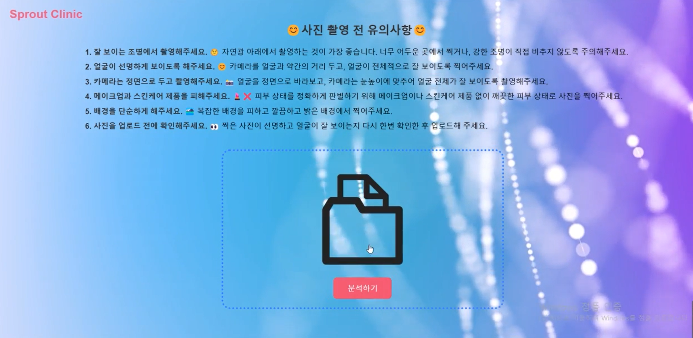
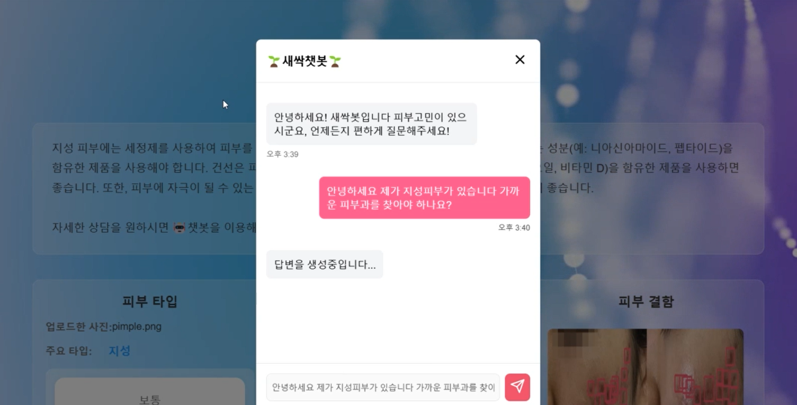

# SeSAClinic 💆✨

> AI 기반 피부 분석 및 개인 맞춤형 케어 상담 챗봇 서비스 프로젝트

<p align="center">
  
  
  
</p>

## 📖 Description
프로젝트는 Kaggle의 "The Movies Dataset"을 활용하여 팀원 각자가 설정한 분석 주제에 따라 다양한 인사이트를 도출하는 것을 목표로 하였습니다. 
팀원들은 각자의 분석 결과를 바탕으로 서로 피드백을 주고받으며 데이터 분석 능력을 향상시키고, 영화 산업에 대한 다양한 통찰을 공유하였습니다. 
이 과정에서 데이터 전처리, 탐색적 데이터 분석, 시각화, 모델링 등 다양한 분석 기법을 적용하여 영화 데이터에 숨겨진 패턴과 트렌드를 파악하였습니다.

## 🗄️ Dataset
👉 Skin Type
- [Kaggle "Oily, Dry and Normal Skin Types Dataset"](https://www.kaggle.com/datasets/shakyadissanayake/oily-dry-and-normal-skin-types-dataset)

👉 Skin Defect
- [Roboflow ""]()

👉 LLM Document
- [Roboflow ""]()

## 🔧 Stack

### Language & Framework
 
 


### DeepLearning

 
 
 

### LLM
 
 
 
 
 

### Data Handling
 


- pillow
- imgaug


### Environment & Resource Management


## 📂 Directory Structure

```markdown
SeSAClinic/
├── data_preprocessing/
│      ├── data_labelling/
│      │      ├── COCOlabeling/
│      │      │        └── coco.py
│      │      ├── YOLOlabelling/
│      │      │        └── yolo.py
│      │      ├── ybat-master/
│      │      ├── dataset_check.py
│      │      ├── annotation_check.py
│      │      └── data_labelling_modify.py
│      ├── none_check.py
│      ├── data_sampling.py
│      └── data_split.py
├── computervision_modeling/
│      ├── Image_classification/
│      │      ├── Alexnet/
│      │      │        ├── data_augmentation.py
│      │      │        ├── alexnet.py
│      │      │        ├── flushing.py
│      │      │        └── wrinkle.py
│      │      └── VGG/
│      │           ├── skintype_vgg16_final.py
│      │           └── pores_vgg16_final.py
│      └── Object_detection/
│                 ├── FasterRCNN/
│                 │       ├── data.py
│                 │       ├── fasterrcnn_model.py
│                 │       ├── pre_train_evaluation.py
│                 │       ├── train_evaluation.py
│                 │       ├── match_label.py
│                 │       ├── matrix_map.py
│                 │       └── main.py
│                 └── YOLO/
├── llm/
│     ├── embedding/
│     │        ├── llm_embedding_KoBERT.py
│     │        ├── llm_embedding_KoELECTRA.py
│     │        ├── llm_embedding_list_kobert_4547.txt
│     │        └── llm_embedding_list_koelectra_3208.txt
│     ├── vectior_database/
│     │        ├── faiss_index_file_kobert_4547.index
│     │        ├── faiss_index_file_koelectra_3208.index
│     │        └── guide.xlsx
│     ├── document_parser.py
│     ├── summary_with_gpt.py
│     └── RAG-query_with_gpt.py
└── img/
│     ├── webimg.png
│     ├── webimg2.png
│     └── webimg3.png
└── icons/
```

## 💡 Team Members 
|이름|역할|Github|
|--|--|--|
|**조유경**|PM, Object Detecting Modeling, RAG LLM Engineer|https://github.com/YugyeongJo|
|**김태진**|Image classification Modeling, Web, MLops|https://github.com/dnwlwlq123|
|**한동우**|Object Detecting Modeling, RAG LLM Engineer|https://github.com/DongwooHan-GitHub|
|**박소연**|Image classification Modeling|https://github.com/amnyday|